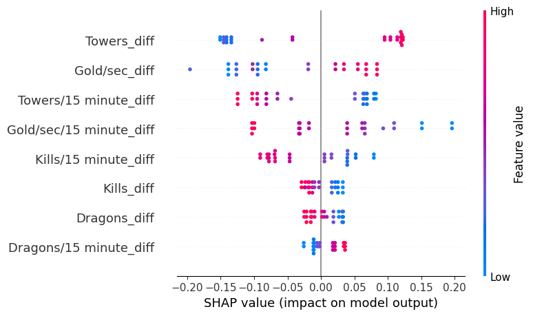

# lol-match-predictor
Predictive ML model for League of Legends pro matches using historical team performance and chronological data splitting. [Python / scikit-learn]

## Model Evaluation & Visualizations

### Baseline Models Comparison
Initial benchmark comparing default classifiers (Logistic Regression, Random Forest, Gradient Boosting, SVM) evaluated on the test set:

### Feature Importance
Feature importance extraction from the Gradient Boosting model. Mid-game differentials (especially objective and gold metrics) have the strongest impact on model predictions:

note: Adding Side Flag yielded minimal performance gain (~X%), suggesting that overall team form and objective control heavily outweigh static side advantages in this dataset.

### PyTorch Model Evaluation

#### How to Interpret the SHAP Summary Plot
The plot illustrates the global impact of each team differential feature on the model's win prediction. Here is the breakdown:

Feature Importance (Vertical Axis): The features are sorted from most important (top) to least important (bottom) based on their overall impact on the final output. The top feature, Towers_diff, has the most spread and furthest dots from the center, making it the strongest predictor.

Feature Value (Color Scale): The color of each dot shows the actual numerical value of that statistic in a specific match from the test set.

Red: A large advantage for Team A (e.g., Team A took many more towers).

Blue: A large disadvantage for Team A (e.g., Team A has fewer towers).

Impact on Model Output (Horizontal Axis): This axis shows how much a particular feature value pushed the model's final win probability up or down.

Positive SHAP Value (Right side): The feature pushed the model to predict "Team A wins".

Negative SHAP Value (Left side): The feature pushed the model to predict "Team A loses".

#### Deep Learning Model Insights (PyTorch)
By analyzing the custom architecture using DeepExplainer, we can see what priorities the neural network has developed compared to the baseline trees:

Key Takeaway: The model has learned that objective control (Towers, Dragons) wins games, while excessive kill differential does not.

Towers_diff (Total Tower Difference): Strongest Predictor. Large tower advantages (red dots far to the right) guarantee a high win probability. Tower disadvantages (blue dots to the left) are fatal. This is perfectly in line with standard League of Legends strategy.

Gold/sec_diff (Overall Gold): Second in importance. Having a consistent gold lead (red) significantly improves win chances, though not as definitively as towers.

Gold/sec/15 minute_diff (Early Gold): Having a gold lead at 15 minutes is a clear positive indicator for the end game.

Kills_diff & Kills/15 minute_diff (Kills Difference): Fascinating Counter-Intuitive Learning. The model's interpretation of kills is fascinating. More kills difference (red values) hurt the final win chance, and fewer kills difference (blue values) help it.

Gameplay Interpretation: The model is likely learning from games where teams chase unnecessary kills instead of pushing advantages (towers, dragons), leading to a "throw." It highlights that a kill differential, by itself, is less valuable than objectives and can sometimes be a negative marker.

Towers/15 minute_diff (Early Towers): A nuances result. The model seems to interpret a very massive early towers advantage (red points clustered slightly to the left) with a negative impact. This could be due to a smaller number of data points with extremely high values, or that specific, ultra-aggressive teams that take early towers also tend to throw leads more often. In contrast, medium advantages show a positive impact. (Keep in mind, a small number of points makes extreme value interpretation less reliable).

Dragons (Total & Early): Following a similar pattern to gold, having more dragons overall improves win chance. An early 15-minute lead is also positive, although slightly less impactful than early gold.
## Automated Data Pipeline (Web Scraping)
The project features a built-in, automated web scraping module designed to extract the most up-to-date match history and team statistics directly from gol.gg.

### Key features of the data ingestion pipeline include:

Dynamic Scraping with Selenium: Utilizes selenium with a headless Chrome browser configuration to navigate dynamic, JavaScript-rendered tables and interactive elements.

Responsive Design Handling: Enforces a strict virtual window size (--window-size=1920,1080) to ensure all hidden statistical columns are rendered and captured by the scraper.

HTML Parsing & Cleaning: Leverages pandas.read_html to efficiently parse the raw DOM elements, automatically mapping them to structured DataFrames and cleaning missing headers on the fly.

Smart Data Caching: Implements a conditional local storage mechanism using the os module. The script checks for existing .csv datasets before execution, giving the user the option to load cached data instantly or trigger a fresh scrape to avoid redundant server requests and save time.

